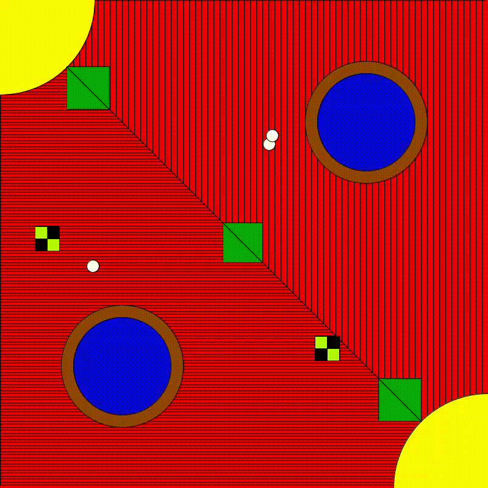

# Artwork Assignment - pSycHeDEliC

## Chinonyerem Ukaegbu

**Description**

The task was to create an art work using Processing in order to practice using the drawing functions we had learnt in class

**Inspiration**

I had no idea what I wanted to create prior to running the software. While Processing was loading and while I was thinking of what to design, Jon Bellion's *Woodstock(Psychedelic Fiction)* came up on my playlist and while listening to it, I looked up the meaning of the word "psychedelic" and found this definition:

*of or noting a mental state characterized by a profound sense of intensified sensory perception, sometimes accompanied by severe perceptual distortion and hallucinations and by extreme feelings of either euphoria or despair.*

It sounded really cool so I decided to base my artwork off of what I thought one would picture in a psychedelic state which is responsible for the symmetric patterns, weird colours and shifting shapes present in the design.

**Process**

* I set the canvas to a square shape with 800x800 dimensions and used the loop to create multiple squares all originating from a square in the top left corner. I also defined a line that passed through diagonals of all the squares, for aesthetic purposes.

.png)

* I then drew two circles with each circle having a concentric circle within it.

.png)

* Then, I drew two arcs at the top left and bottom right corners of the canvas.

.png)

* Then, I drew three triangles equally spaced right angled triangles with hypotenuses along the diagonal line of canvas and created a reflection of these triangles along that line.

.png)

* Then came the squares floating around the screen. I created three squares and made their positions random so that it seemed as though they were floating around the screen.

.png)

* Finally, the circles floating around the screen. i added those because they reminded me of the little spots we see when we close our eyes and face a light source.

.png)

I wanted a sort of alternate universe with the same shapes but different colours so I added some code to switch between modes when the mouse crossed over the 400 x-coordinate.]

* So the background became:

.png)

* Then the circles:

.png)

* The arcs:

.png)

* The triangles:

.png)

* The squares:

.png)

* And the points:

.png)

Now, the final product looks like this:

 

**Difficulties**

It was a bit confusing finding points on the canvas but displaying the mouse coordinates was very helpful. Also, there was a lot of trial and error with positioning and using the if() function for each object I created was quite tedious but not impossible. And at some point, I wanted to assign a pair of coordinatesto a variable but I didn't know what function to use and I tried a bunch but I didn't get the results I was hoping for, so I just scratched that. It was a really fun project to do and I really enjoyed creating it.
