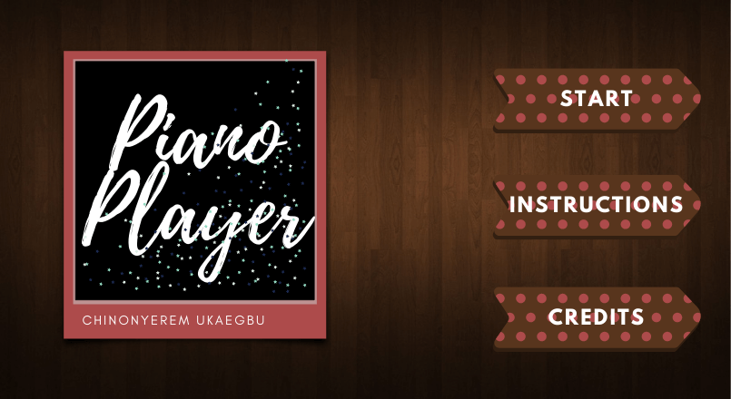
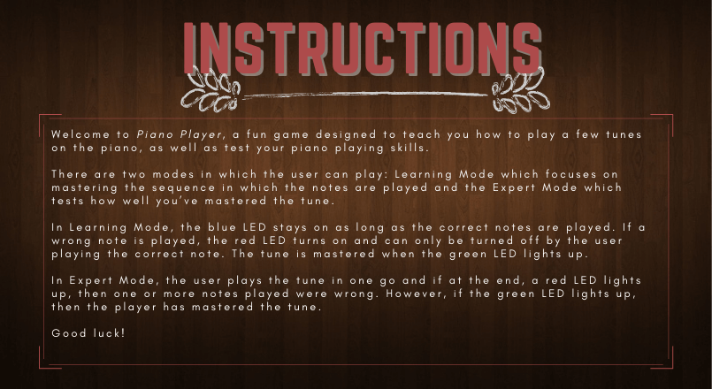
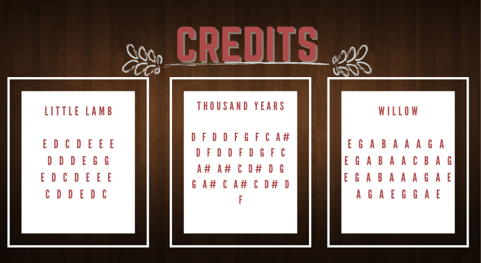
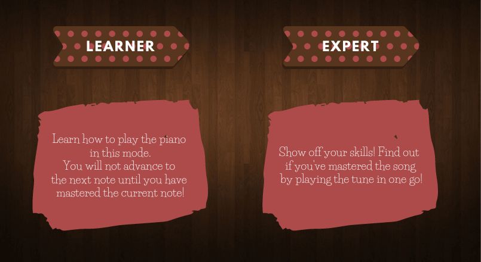
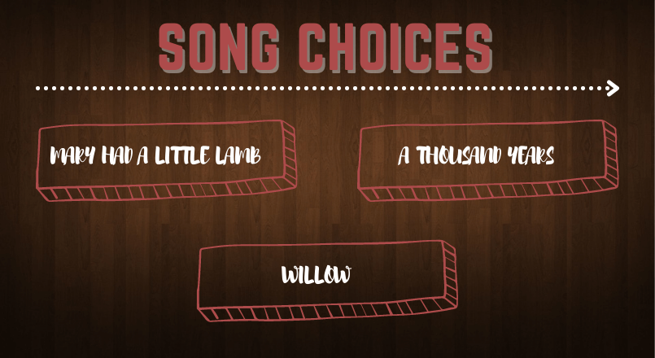
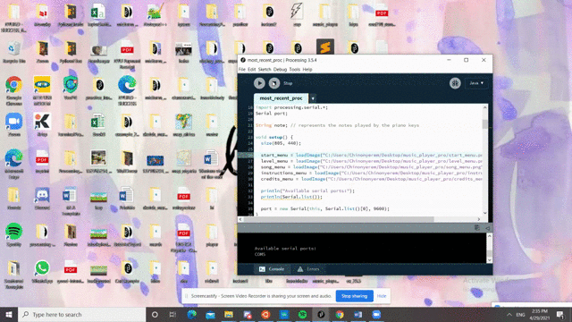

# Final Project - *Piano Player 2.0*

## Chinonyerem Ukaegbu

**Description**

For my final project, I created a game which was a continutation of the Piano Player game from last week.
The current version of the game, Piano Player 2.0 has more functionality than the previous version ([Link to Piano Player](https://github.com/ChinoUkaegbu/IntrotoIM/tree/main/April13)):

+ There are two modes: Learning Mode and Expert Mode
+ Improved aesthetics and navigation

**Process**

Since I had gotten the piano keys working previously, I created the menus which would help the users navigate from page to page

Start Menu

Instructions Menu

Credits Menu

Level Menu

Song Menu

**21st April 2021**

I created the functions that would check if the correct notes were playing for the 2 additional songs I added (so now there are three songs: Mary Had a Little Lamb, A Thousand Years and Willow)
Reference: http://www.mintmusic.co.uk/2015/04/a-thousand-years-christina-perri.html
http://www.mintmusic.co.uk/2021/02/willow-taylor-swift.html

**24th April 2021**

The pauses between each key press have to be longer to avoid arduino mixing up the notes. I wonder why?

**GIFs**

**Pictures**

