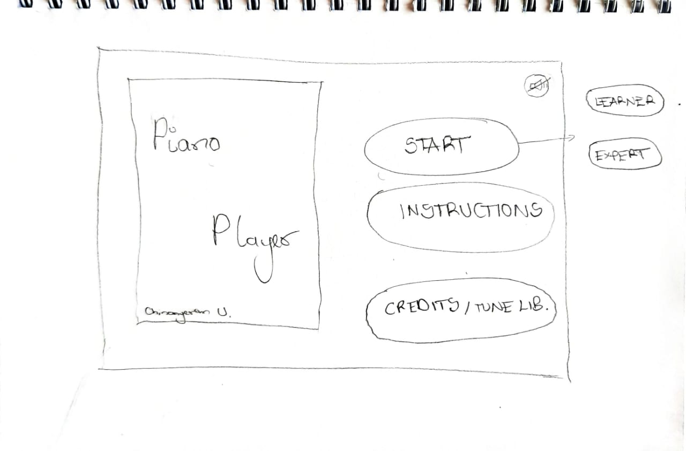

# Final Project Proposal

## Chinonyerem Ukaegbu

**Description**

For my final project, I'd like to continue the idea from Piano Player, the game I created for Tuesday's project.
The current version is limited and has only one song but I plan on adding more functionality, particularly:
+ creating more modes for the user to play in. The current mode is called the *Learning Mode* because the user is not allowed to progress to the next note until they have mastered the note before. But in the *Expert Mode*, the user will play the tune at one go and signify that they are done by pushing a button. If they are correct, they get to advance, but if not, they have to restart the entire level
+ adding more songs, with increasing difficulty, to make the game more interesting
+ improving programming aesthetics, a nice background maybe, and background music playing in the menu and instructions tab, just to like make it look nice you know

**Arduino**

The circuit would be like the circuit from the last project which I'm linking in the bracket (https://github.com/ChinoUkaegbu/IntrotoIM/tree/main/April13), but with the addition of a switch to indicate that the user is done playing the tune in *Expert Mode*

**Processing**

The menu should kind of look like this (please spare my far from art work sketches😂):

+ In addition to the already implemented functions, Processing would have to create this menu, display it, recognize mouse clicks and yeah
+ Some variables to keep track of what options are being selected

**Fears**

My biggest concern is how Processing and Arduino will communicate. It's working perfectly fine now, but with the new improvements, will it stop working? I guess I'll have to implment it and find out

**Side Note**

Also, I was thinking of having a background like this, IDK, it just looks so woody??! and gives off the whole spooky, piano playing in a castle on a rainy night vibe

