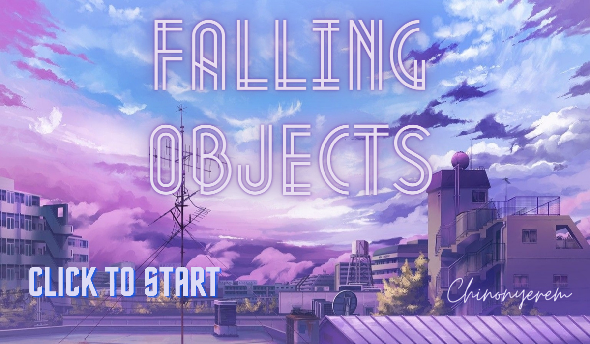
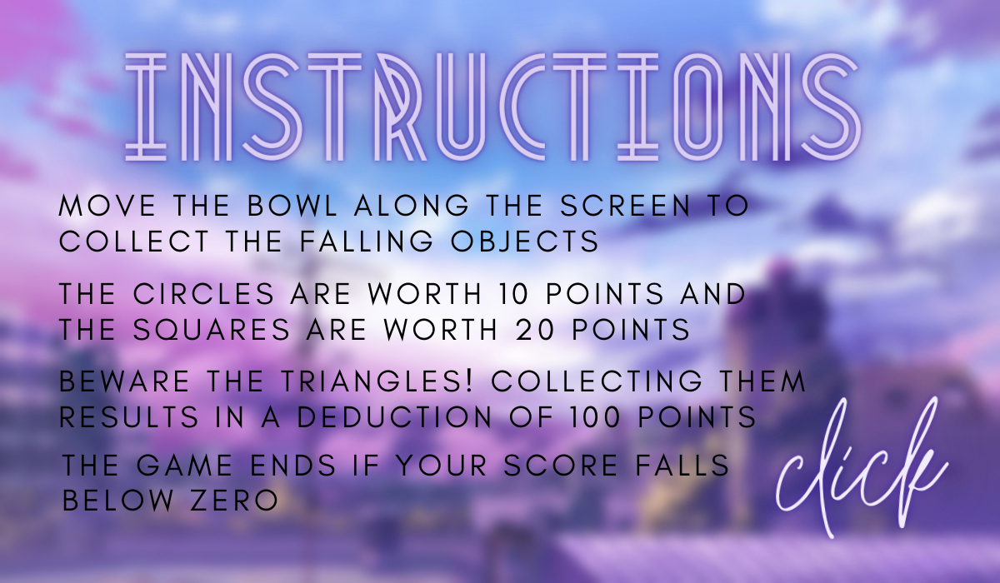
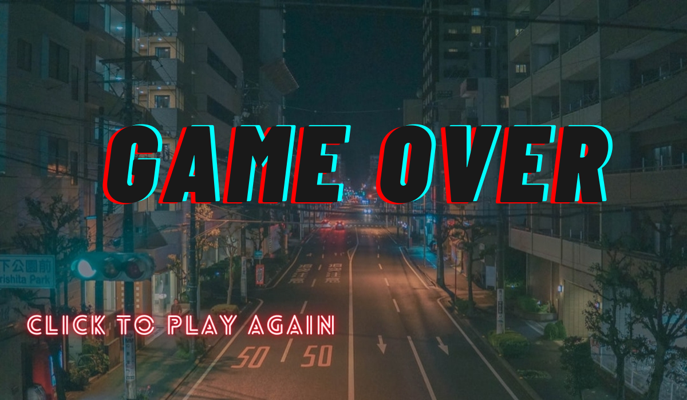
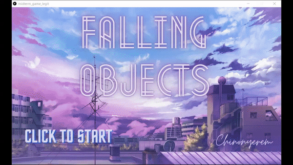

# Midterm Project - *Falling Objects*

## Chinonyerem Ukaegbu


**Description**

The task was to create a game using everything we've learnt so far.

**Inspiration**

The game I created is called Falling Objects and was inspired by a game I used to play when i was younger called *The Incident*

**How to Play the Game**
+ The game is designed for one player use
+ The player moves the bowl along the screen to collect the falling objects
+ The circles are worth 10 points and the squares are worth 20 points.
+ Watch out for the triangles! Collecting them results in a deduction of 100 points.
+ The game ends if your score falls below zero.
+ Goodluck!

**Process**

Most of the beginning process can be found in the journal.md file: [MidtermJournal](https://github.com/ChinoUkaegbu/IntrotoIM/blob/main/midtermProject/journal.md)

+ After I had figured out the frame work for the game, I created three classes for the falling objects: a class for the squares, a class for the circles and a class for the triangles.

[SquareClass](https://github.com/ChinoUkaegbu/IntrotoIM/blob/main/midtermProject/SquareClass.pde)

[TriangleClass](https://github.com/ChinoUkaegbu/IntrotoIM/blob/main/midtermProject/TriangleClass.pde)

[CircleClass](https://github.com/ChinoUkaegbu/IntrotoIM/blob/main/midtermProject/CircleClass.pde)

(The classes have essentially the same functions in each of them, just modified with respect to each shape)

+ Then I got to work on creating the illusion that the objects were falling from the sky and being collected in the bowl moving along the screen. Take for instance the code for the triangles:

```js
for (i = 0; i < triangles.length; i++) {
    checkScore();
    triangles[i].display();
    triangles[i].fall();
    if ((triangles[i]).x1 >= (mouseX - 30) && (triangles[i]).y1 == 510 && (triangles[i]).x3 <= (mouseX + 50) && (triangles[i]).y3 == 510) {
      triangles[i].disappear();
      losePoints.play();
      score -= 100;
    } else {
      if (triangles[i].y2 == height) {
        //triangles[i].reset();
        triangles[i].fillers();
      }
    }
  }
```
The display function is responsible for creating the triangle and colouring it. The fall function created the illusion of the triangle moving down by incrementing the y-coordinates of each vertex. And if the triangle touched the rim of the bowl, it would be "collected" using the disappear function. I needed a way for the objects to keep falling until the game was lost, so I just reset the y coordinates to zero and randomized the x-coordinates using the reset and fillers functions.

+ After that, I created a variable "score" which would keep track of the score and would be printed in text form on the bottom of the screen so that the player could keep track of their score.
+ Then, I needed a way to restart the game without closing and opening the Processing screen. I first designed three screens online. 

An initialization screen:


An instructions screen:


And an end screen


+ I used the mouseClicked function to control what screen was being displayed and at what time and initialized a variable called GameScreen on whose values the screen displayed was dependent on 

+ I then added some background music to the code that would play as long as the code was running and would loop even after the song had played once.

+ I also included sound effects when points were gained (i.e. when the squares and circles were collected) and when points were lost (i.e. when the triangles were collected)

+ A sample game play is included below:



**Difficulties**

+ Making the objects disappear: I battled with this for several days and I initially opted to move the objects to the bottom of the screen if they were collected but eventually realized that I had been setting the alpha value of the colours wrongly.
+ Displaying the correct game screen: I still haven't figured this out completely. If you notice, the instructions screen actually isn't displayed. I thought of removing it completely but I decided against it.
+ Making the objects fall continuosly until game ended: I sorted this out by resetting the y-coordinates to zero and if you look closely at the triangles and , they seem to just pop up out of nowhere at times. This is because of the fillers() function and I added it to sort of create an element of surprise in the game.
+ 
**Interesting Things I Found**

+ rectMode() and ellipseMode() - which can change how the origin is defined for rectangles and ellipses
+ alpha values - which are responsible for transparency in colours
+ public keyword 

**Possible Improvements**

+ Because of the sound files, the program lags a little so perhaps I could do something to improve that - maybe converting from mp3 to aif or wav
+ I was thinking of switching the background image to another image after some frames had passed and using the modulus to alternate between the two images (the first would be the current background image and the second, a night time themed image to indicate that time has passed) but I didn't want to slow the program down
+ Increasing speed of objects falling as time passes

**Conclusion**

This was a really cool project to do and I thoroughly enjoyed it. I especially loved the sound effects because they sounded so real as though they had been produced by actual interaction between objects and not just lines of code. I also find the fact that we can simulate certain events just by writing code really intriguing and this project further fuelled my amazement. 

**Cool Things the Game Does**

Okay so this isn't really cool but you might have noticed the alternator variable in the function. Basically all it does is help me switch between 0 and 1 using modulus
``` js
if ((circles[i]).y - (circles[i]).radius == height) {
        alternator++;
        if (alternator%2 == 0) {
          circles[i].reset();
        } else {
          circles[i].fillers();
        }
```
Okay it does sound a bit boring on its own but I used it to determine where the circles would appear from when they had been reset (either from the top or from the middle of the screen) which honestly leaves so much to wonder about the potential of modulus.
