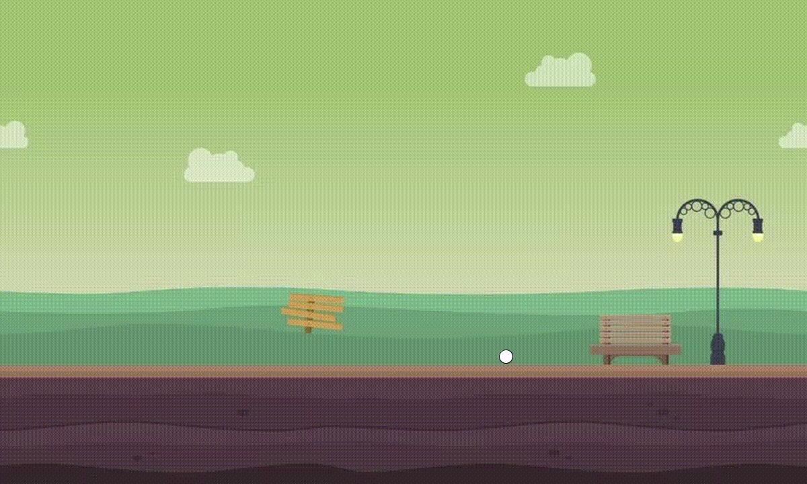
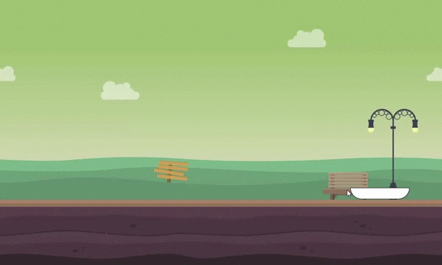

# Journal for IM Midterm Project

## Chinonyerem Ukaegbu

### Additional (after Minimum VP)
+ Day and night mode: after say 20 mouse clicks, keypresses, whatever, background changes from day to night
+ But would the images on top of it continue the same?
+ Think setup() or draw()?

### February 22
+ Uploaded background as image this time
+ A bit confused about where I would put the background(either setup or draw)
+ Put it in setup() at first and got this:

.png)

+ Realized my mistake and moved it to draw(). I also found out that writing the code for the background after the code for the ball would result in the ball being covered by the background instead of drawing over the background so that was really cool.
+ I also found out the dimensions I had to use for the ball to look as if it were rolling smoothly on the ground when the mouse was moved. Now I have to see how I'll implement this when I change it from a ball to the actual object that would catch the falling objects. Sigh

### February 26
+ Created "bowl" that would collect the falling objects and programmed it so that it would move in the same way as the rolling ball. TO be honest, I was kind of scared that here would be lag because I used mouseX and the bowl would be moving very frequently but, so far, so good :smiley:

+ Will try working on creating the objects falling down the sky today. Thinking of it being like either by shape or by colour. I should get the colour working first though at least. But the idea is that after a certain frameCount maybe, there will be text displayed on the screen as per collect triangle, circle, you g sha regardless of colour. That is if I don't fall asleep first :guardsman:
+ I also discovered rectMode() and ellipseMode(). Wonder if I'll use them. They have the potential to make drawing these shapes a bit easier.
